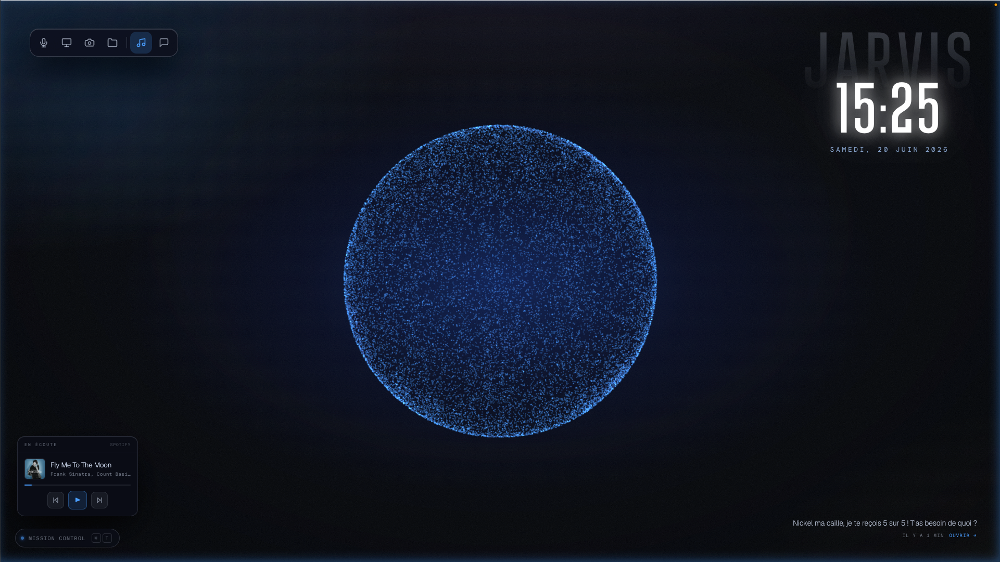
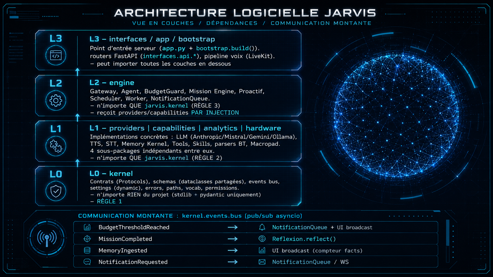

<div align="center">

# CRUSH-OS

**Un assistant personnel qui tourne chez toi, se souvient de toi, et agit pour toi.**

[](https://github.com/Ironmaaax/Crush-OS)
[](https://github.com/Ironmaaax/Crush-skills)

[](https://python.org)
[](https://fastapi.tiangolo.com)
[](https://developer.mozilla.org/fr/docs/Web/API/WebSockets_API)
[](#les-cinq-portes-qualité)
[](#architecture)



</div>

---

## Ce que c'est

Crush est un assistant personnel qui tourne sur **ta** machine. Un serveur
FastAPI unique gère le chat écrit, un pipeline vocal temps réel, une mémoire
persistante et 28 outils.

Ce qui le distingue d'une interface de chat classique :

- **Il se souvient vraiment.** Pas un historique de conversation, mais des faits
  atomiques datés, sourcés, renforcés quand tu les répètes, archivés quand tu les
  contredis — jamais supprimés.
- **Il agit.** Lire un fichier, lancer une commande, jouer un morceau, transcrire
  un vocal, chercher sur le web, piloter ton PC à distance.
- **Il prend des initiatives**, dans un cadre que tu contrôles (niveaux
  d'autonomie 0 à 5).
- **Tout reste chez toi.** SQLite en local, modèles locaux possibles, aucune
  ressource chargée depuis un tiers dans l'interface.

> **Nouveau ici ?** Le document [**Comment ça marche**](docs/COMMENT_CA_MARCHE.md)
> explique le fonctionnement interne avec des schémas : le trajet d'un message, la
> mémoire, les tâches nocturnes, la sécurité.

---

## En un coup d'œil

| | |
|---|---|
| **Entrées** | Navigateur (chat + voix), Telegram, agent PC distant, Discord/Slack/Signal/WhatsApp |
| **Modèles** | Anthropic Claude, OpenAI, Mistral, Google Gemini, ou Ollama en local |
| **Mémoire** | SQLite (vérité) + index vectoriel (recherche) + miroir Markdown (lecture) |
| **Outils** | 28, de la lecture de fichier à la création de nouvelles compétences |
| **Voix** | WebSocket direct — pas de serveur média. Whisper (cloud ou local) + Piper/ElevenLabs |
| **Cible** | Windows, Linux, macOS. Tourne en permanence sur un Raspberry Pi 5 |
| **Qualité** | 1650 tests, 4 contrats de couches, 208 routes figées |

---

## Architecture

Le code est organisé en **quatre couches strictes**, vérifiées automatiquement
par [import-linter](https://pypi.org/project/import-linter/) à chaque validation.



```
L3  interfaces / app / bootstrap    routes HTTP, WebSockets, canaux, câblage
L2  engine                          Gateway, Agent, missions, moteur proactif
L1  providers / capabilities        mémoire, LLM, audio, outils
    analytics / hardware
L0  kernel                          contrats (Protocol), schémas, réglages
```

| Règle | Ce qu'elle interdit |
|---|---|
| **RÈGLE 1** | Le `kernel` ne dépend de rien. |
| **RÈGLE 2** | `providers`, `capabilities`, `analytics`, `hardware` n'importent **que** `kernel`. |
| **RÈGLE 3** | `engine` n'importe **que** `kernel` — jamais `providers`. |
| **RÈGLE 4** | Aucun module ne passe par l'ancien dossier `config/`. |

La RÈGLE 3 est la plus contraignante : le moteur a besoin de la mémoire, qui vit
dans `providers`. Il y accède par des `Protocol` déclarés dans `kernel/contracts.py`
et branchés par `bootstrap.py` — la seule couche autorisée à voir les deux côtés.

**Détails et schémas** : [`docs/COMMENT_CA_MARCHE.md`](docs/COMMENT_CA_MARCHE.md#2-les-quatre-couches-et-pourquoi-elles-sont-strictes)

---

## Prérequis

Deux profils distincts.

### Utilisateur final (Windows)

Tu clones le dépôt (ou décompresses une archive) **sans le dossier `bundle/`** :
l'assistant web le télécharge pour toi en un clic (~650 Mo). Tu n'as **pas** besoin
d'installer Python, uv, cmake ni Visual C++.

| Requis | Notes |
|---|---|
| Windows 10/11 | |
| PowerShell | Pour lancer `crush.ps1` |
| Navigateur web | Configuration sur `http://127.0.0.1:8765/setup` |
| Connexion internet | Uniquement pour le premier téléchargement du bundle |
| Clé API d'un LLM | Une seule suffit, saisie dans l'assistant web |

Le bundle embarque un Python 3.11 **autonome et relocalisable**
(`bundle/python`), son environnement virtuel, les dépendances, les modèles ML
(YOLO, Piper) et `uv.exe`. Au premier `setup`, l'environnement est
automatiquement ré-ancré sur la machine cible.

> **Release offline pré-construite** : si ton archive contient déjà `bundle/`, le
> bouton Télécharger n'apparaît pas — tu passes directement à la configuration.

### Développeur

| Outil | Notes |
|---|---|
| [uv](https://docs.astral.sh/uv/) | Télécharge un Python 3.11 relocalisable + crée le venv |
| Réseau | Pour les dépendances, modèles et binaires |

Python système **n'est pas requis** : le script de build l'intègre au bundle.

### Modules optionnels

| Module | Notes |
|---|---|
| [Docker](https://docs.docker.com/) | Bac à sable du Skill Lab et de l'agent de code. **En mode rootless** — voir [Sécurité](#sécurité) |
| `uv sync --extra vision` | Détection d'objets YOLOv8 + OpenCV. Déjà inclus dans le bundle Windows |
| `uv sync --extra face` | Reconnaissance faciale — `dlib` compile depuis les sources ; sur Windows peut exiger [Visual Studio Build Tools](https://visualstudio.microsoft.com/visual-cpp-build-tools/) |
| `faster-whisper` | Transcription **locale**, repli quand le cloud est indisponible. Fortement recommandé — sans lui, un quota épuisé supprime la voix au lieu de la dégrader |
| `nowplaying-cli` | macOS uniquement, lecture « now playing » |

---

## Installation

### Parcours A — Utilisateur final (Windows)

Le plus simple : **double-clique sur `setup.bat`**, puis sur `run.bat`. En ligne
de commande :

```powershell
# 1. Ouvrir le dossier (hors OneDrive — voir l'avertissement ci-dessous)
cd C:\crush-OS

# 2. Configuration web (télécharge le bundle si absent)
.\crush.bat setup

# 3. Démarrage
.\crush.bat run
```

> **OneDrive interdit.** OneDrive casse les liens symboliques du venv Python
> embarqué. Au premier lancement, Crush **bloque l'installation** et propose un
> déplacement automatique vers un dossier local.

> **Pourquoi `.bat` et pas `.ps1` ?** Windows bloque par défaut l'exécution des
> scripts PowerShell téléchargés. Les lanceurs `.bat` appellent `crush.ps1` en
> `-ExecutionPolicy Bypass`. Pour utiliser les `.ps1` directement :
> `Set-ExecutionPolicy -Scope CurrentUser RemoteSigned` puis
> `Get-ChildItem -Recurse *.ps1 | Unblock-File`.

| Commande | Rôle |
|---|---|
| `.\crush.ps1 setup` | Assistant de configuration (port 8765) |
| `.\crush.ps1 run` | API — chat et vocal (`/ws/voice`) |
| `.\crush.ps1 api` | Serveur FastAPI seul |
| `.\crush.ps1 doctor` | Diagnostic |

Le log du run est dans `%TEMP%\crushpi.log`, réinitialisé à chaque démarrage.

### Parcours B — Construire le bundle (développeur)

À faire **une fois**, avec réseau.

```powershell
# Windows
git clone https://github.com/Ironmaaax/Crush-OS.git
cd Crush-OS
.\scripts\release\build_bundle.ps1
.\crush.ps1 setup
```

```bash
# Linux / macOS
git clone https://github.com/Ironmaaax/Crush-OS.git
cd Crush-OS
bash scripts/release/build_bundle.sh
./crush eclosion
```

### Parcours C — Développement sans bundle

```bash
uv sync
uv sync --extra vision                  # optionnel
python scripts/vendor_assets.py         # assets front (~64 Mo)
```

Puis `./crush eclosion` ou `.\crush.ps1 setup`.

> **Assets front.** L'interface ne charge **aucune ressource depuis un tiers** :
> polices, `three`, `gsap` et `mermaid` sont versionnés dans le dépôt. Les
> runtimes WebAssembly de MediaPipe (~64 Mo, trop lourds pour git) sont récupérés
> par `scripts/vendor_assets.py`, chaque fichier épinglé à une version exacte et
> vérifié par empreinte SHA-256 au téléchargement **et** à chaque démarrage.

> **Serveur headless (VPS, conteneur)** : la détection de double-clap et le micro
> local écoutent le périphérique audio de la machine hôte. Sur un serveur sans
> audio, mets `CLAP_DETECTION_ENABLED=false` dans `.env`.

### Parcours D — Raspberry Pi (service permanent)

```bash
bash scripts/install_pi.sh
```

Le script installe l'environnement, le moteur de transcription local, les unités
systemd (API, surveillance de santé, sauvegarde hors machine) et les active.

---

## Configuration

Tout passe par l'assistant web. Pour modifier après coup, édite `.env` — chaque
réglage y est documenté dans [`.env.example`](.env.example).

### Choix du modèle

Une seule clé est requise, celle du backend choisi. **Anthropic n'est pas
obligatoire.**

| `API_BACKEND` | Clé requise | Notes |
|---|---|---|
| `anthropic` | `ANTHROPIC_API_KEY` | |
| `openai` | `OPENAI_API_KEY` | Appels d'outils supportés |
| `mistral` | `MISTRAL_API_KEY` | Appels d'outils supportés |
| `local` | aucune | Ollama en local |

### Le réglage à ne pas manquer

`ENVIRONMENT` **n'est pas cosmétique** — il commande deux choses :

1. Le **rechargement automatique** du code. En service permanent, il ajoute un
   processus surveillant (~170 Mo mesurés sur un Pi 5) et recharge l'application
   dès qu'un fichier bouge, y compris en pleine copie pendant un déploiement.
2. Le drapeau **`Secure`** du cookie de session. Sans lui, le cookie voyage aussi
   en HTTP clair.

**La règle** : `development` tant que l'accès se fait en `http://` (premier
démarrage local) ; `production` **dès que** l'accès passe par `https://`. Basculer
avant d'avoir HTTPS casse la connexion — le navigateur refuse d'envoyer un cookie
`Secure` sur une page non chiffrée.

### Intégrations

- **Google (Gmail / Calendar)** : place ton `credentials.json` dans
  `config/google_credentials.json`. Crush ouvrira le flux OAuth au démarrage et
  gardera les jetons en local (gitignorés).
- **Reconnaissance faciale** : place une photo dans
  `vision_data/faces/reference.jpg` (dossier gitignoré), puis
  `FACE_RECOGNITION_ENABLED=true`.
- **Telegram** : voir [la section dédiée](#telegram--laccès-mobile).

---

## Les 28 outils

| Domaine | Outils |
|---|---|
| **Mémoire** | `memory_search`, `memory_write`, `memory_load_topic`, `memory_journal`, `session_recall` |
| **Monde extérieur** | `browser`, `get_weather`, `list_emails`, `list_calendar_events`, `create_calendar_event`, `notion_tasks`, `spotify_control` |
| **Machine** | `read_file`, `find_files`, `execute_cli`, `run_script`, `execute_script`, `remote_pc` |
| **Perception** | `vision` (YOLOv8), `transcribe_audio` |
| **Auto-évolution** | `skill_create`, `skill_improve`, `skill_list`, `spawn_subagent`, `report_missing_capability` |
| **Pilotage** | `show_view`, `initiatives`, `execute_preset` |

Les outils qui touchent au système de fichiers ou au réseau passent par un
contrôle de permission et un périmètre de répertoires autorisés
(`FILE_SEARCH_ROOTS`). Le détail des refus est
[documenté avec un schéma](docs/COMMENT_CA_MARCHE.md#6-les-outils--28-capacités).

---

## La mémoire

Crush ne mémorise pas en vrac. Il extrait des **faits atomiques** — *sujet,
prédicat, objet* — les date, les source, les renforce, et les archive quand ils
sont contredits.

```
max  prefers  concision   (preference, confiance 0.75, vu 2 fois)
max  is       cergy       (identity,   confiance 0.55, vu 1 fois)
```

| Forme | Rôle |
|---|---|
| **SQLite** `crush_memory.db` | **Source de vérité unique.** Quatre tables : `events`, `facts`, `fact_observations`, `fact_relations` |
| **Index vectoriel** | Recherche sémantique. Régénéré depuis SQLite |
| **Miroir Markdown** | Lecture seule, compatible Obsidian. Régénéré depuis SQLite |

**Rien n'est jamais supprimé.** Un fait contredit passe en `superseded` et reste
relié à son remplaçant : l'historique est vérifiable.

Le miroir est **unidirectionnel** — éditer un `.md` ne change pas la mémoire. Pour
corriger un souvenir depuis ton téléphone, une **boîte de réception** accepte des
consignes en langage naturel (« non, je préfère le thé »), lues par la passe
nocturne.

**Comment un fait naît, vit et meurt** :
[schéma détaillé](docs/COMMENT_CA_MARCHE.md#5-comment-un-fait-naît-vit-et-meurt).

---

## Le moteur proactif

Crush peut entreprendre sans qu'on le lui demande, dans un cadre explicite. Chaque
initiative porte un déclencheur, un objectif, un coût maximum et un **niveau
d'autonomie de 0 à 5** — de « répondre seulement » à « publier / payer /
contacter », ce dernier exigeant toujours une validation humaine.

- **Collecteurs** — captent les signaux : météo, actualités, trackers
  personnalisés. Extensibles en ajoutant un fichier.
- **Command Center** — la vue unifiée : objectifs, budgets, permissions, coûts.
- **Curator nocturne** — produit un rapport et **propose** des correctifs : faits
  contradictoires, compétences inutilisées, prompts qui ont dérivé.

Les initiatives arrivent sur Telegram avec des boutons — tu réponds d'un appui.

---

## Telegram : l'accès mobile

Même modèle, même mémoire, mêmes outils, depuis ton téléphone.

1. **Créer le bot** — `@BotFather` → `/newbot`. Il te donne un token.
2. **Ton identifiant** — `@userinfobot` → envoie un message, il répond ton ID.
3. **Configurer** :

```env
TELEGRAM_BOT_TOKEN=7xxxxxxxxx:AAF...
TELEGRAM_OWNER_ID=123456789
TELEGRAM_ENABLED=true
```

4. **Lancer**, puis `/start` dans le chat avec ton bot.

| Commande | Action |
|---|---|
| `/start` | Bienvenue + commandes |
| `/status` | État de tous les composants |
| `/initiatives` | Initiatives en attente |
| `/help` | Aide complète |
| Message libre | Parle normalement |

**Sécurité** : seul ton `TELEGRAM_OWNER_ID` est autorisé. Tout autre compte est
refusé sans traitement.

> Ne lance pas Telegram sur deux machines à la fois : deux interrogations longues
> sur le même token s'excluent mutuellement.

---

## Sécurité

Les choix qui comptent, sur une installation exposée (Pi, VPS) :

- **L'application n'écoute que sur `127.0.0.1`.** Tout l'accès passe par un proxy
  chiffré — [Tailscale](https://tailscale.com) dans l'installation de référence.
- **Cookie de session** `Secure` + `HttpOnly` + `SameSite=strict`.
- **Docker en mode rootless.** Le code écrit par le modèle s'exécute dans un bac à
  sable, et le compte qui le lance n'est **pas** dans le groupe `docker` — cette
  appartenance équivaut à un accès root complet.
- **Les clés n'entrent jamais dans une archive.** Le module de sauvegarde filtre
  `.env`, `*.pem`, `*.key` et les fichiers de jetons, même hors du périmètre
  archivé : « hors périmètre » est une propriété accidentelle, pas une garantie.
- **La clé de sauvegarde ne peut rien exécuter** — restreinte à `internal-sftp`,
  elle ne donne aucun accès à un terminal même si elle est volée.
- **Authentification obligatoire** dès que la machine est joignable d'ailleurs :
  `API_AUTH_ENABLED=true`.

---

## Déploiement et surveillance

### Déployer

```bash
scripts/deploiement_pi.sh              # tout ce que git voit de modifié
scripts/deploiement_pi.sh src/crush/app.py   # une liste explicite
```

Le script envoie, redémarre **explicitement**, attend la santé HTTP, puis compare
les sommes SHA-256. Il vérifie le droit de redémarrage **avant** d'envoyer : sinon
on écrase les fichiers puis on découvre qu'on ne peut pas les activer, et le
service tourne sur l'ancien code sans que rien ne le dise.

### Être prévenu quand ça tombe

| Unité | Ce qu'elle attrape |
|---|---|
| `crush-sante.timer` | Toutes les 5 min : API muette, boucle de redémarrage sous la limite |
| `crush-alerte@` | Branché en `OnFailure=` : le moment où systemd renonce |
| `crush-offsite-backup.timer` | Toutes les 2 h : pousse la sauvegarde hors machine |
| `crush-offsite-backup-check.timer` | Toutes les 6 h : alerte si > 72 h sans copie réussie |

**Le principe : on signale les transitions, jamais les états.** Un contrôle toutes
les 5 minutes sur un service en panne enverrait douze messages par heure — et la
première réaction serait de couper les notifications, donc de perdre l'alerte
utile.

Les scripts de surveillance sont en **bash**, pas en Python : ils sont appelés
précisément quand l'application est en panne.

```bash
bash scripts/sante.sh --etat                  # ce que la surveillance retient
bash scripts/offsite_backup_check.sh --etat   # âge de la dernière copie
bash scripts/alerte.sh "test"                 # vérifier le canal
```

**Ce que ça ne couvre pas** : la machine éteinte. Rien tournant *sur* la machine
ne peut le signaler.

---

## Les cinq portes qualité

Rien n'est déployé sans que les cinq passent.

```bash
make lint       # ruff + import-linter
make typecheck  # mypy
make test       # pytest
```

| # | Porte | Vérifie |
|---|---|---|
| 1 | `ruff check` | Style, lignes ≤ 100, annotations exigées |
| 2 | `import-linter` | Les 4 contrats de couches |
| 3 | `mypy` | Conformité des `Protocol` au démarrage |
| 4 | `pytest` | **1650 tests** (hors intégration) |
| 5 | `snapshot_routes` | Les **208 routes HTTP** identiques à la référence |

Plus un démarrage réel :

```bash
python scripts/validation/smoke_runtime.py --fake-llm   # doit afficher BOOT OK
```

La cinquième porte existe parce qu'une refonte peut casser une route sans qu'aucun
test ne le voie. La liste est figée dans un fichier de référence.

---

## Développement

```bash
# En un coup
make test lint typecheck

# Détail
uv run pytest -m "not integration" -q
uv run ruff check && uv run ruff format
uv run lint-imports
uv run mypy

# Test LLM manuel
uv run python scripts/test_llm.py --stream
uv run python scripts/test_llm.py --provider mistral
```

> Si `uv run lint-imports` échoue avec « Failed to canonicalize script path »
> (lanceur cassé sous Windows), utilise l'API Python directement — voir
> [`docs/architecture/`](docs/architecture/).

---

## Documentation

| Document | Contenu |
|---|---|
| [**Comment ça marche**](docs/COMMENT_CA_MARCHE.md) | Le fonctionnement interne, avec schémas |
| [`.specify/memory/constitution.md`](.specify/memory/constitution.md) | Les principes non négociables |
| [`docs/architecture/`](docs/architecture/) | Cahier des charges, bus d'événements, ABI des compétences |
| [`.env.example`](.env.example) | Tous les réglages, documentés |
| [`docs/migration/BACKLOG.md`](docs/migration/BACKLOG.md) | Résidus de migration |

---

## Dashboard Monde (optionnel)

L'onglet **Intel Monde** affiche
[World Monitor](https://github.com/Ironmaaax/dashboard_monde), un tableau de bord
géopolitique temps réel (globe 3D, flux d'actualités, radars financiers).

```bash
git clone https://github.com/Ironmaaax/dashboard_monde.git
cd dashboard_monde && npm install && npm run dev -- --port 3000
```

Node.js 18+ requis. Une fois lancé, l'onglet l'affiche automatiquement.

---

## Stack technique

- **Python 3.11** — async, FastAPI, uvicorn
- **LLM au choix** — Anthropic, OpenAI, Mistral, Gemini, Ollama
- **WebSocket** — pipeline vocal temps réel, intégré à l'API
- **faster-whisper** (local) / **Deepgram**, **OpenAI Whisper** (cloud) — transcription
- **Piper** (local) / **ElevenLabs** (cloud) — synthèse vocale
- **fastembed** — embeddings multilingues ONNX, 384 dimensions, hors ligne
- **YOLOv8** — détection d'objets
- **SQLite** + **FTS5** — mémoire et recherche plein texte
- **pydantic-settings** — configuration typée
- **loguru** — journalisation structurée
- **uv** — gestion des dépendances
