# Comment Crush fonctionne

Ce document explique le fonctionnement interne de Crush, du message que tu tapes
jusqu'à la réponse — en passant par la mémoire, les outils et les tâches qui
tournent la nuit.

Il est écrit pour être lu dans l'ordre, mais chaque partie se tient seule.

**Table des matières**

1. [La vue d'ensemble en un schéma](#1-la-vue-densemble-en-un-schéma)
2. [Les quatre couches, et pourquoi elles sont strictes](#2-les-quatre-couches-et-pourquoi-elles-sont-strictes)
3. [Le trajet d'un message](#3-le-trajet-dun-message)
4. [La mémoire : trois formes, une seule vérité](#4-la-mémoire--trois-formes-une-seule-vérité)
5. [Comment un fait naît, vit et meurt](#5-comment-un-fait-naît-vit-et-meurt)
6. [Les outils : 28 capacités](#6-les-outils--28-capacités)
7. [Ce qui tourne la nuit](#7-ce-qui-tourne-la-nuit)
8. [Le moteur proactif](#8-le-moteur-proactif)
9. [La voix, de bout en bout](#9-la-voix-de-bout-en-bout)
10. [Sécurité : ce qui est fermé, et pourquoi](#10-sécurité--ce-qui-est-fermé-et-pourquoi)
11. [Déploiement et surveillance](#11-déploiement-et-surveillance)
12. [Les cinq portes qualité](#12-les-cinq-portes-qualité)

---

## 1. La vue d'ensemble en un schéma

Crush est un serveur FastAPI unique. Il reçoit des messages par plusieurs
canaux, les fait traverser un moteur de décision, et peut appeler des outils
avant de répondre.

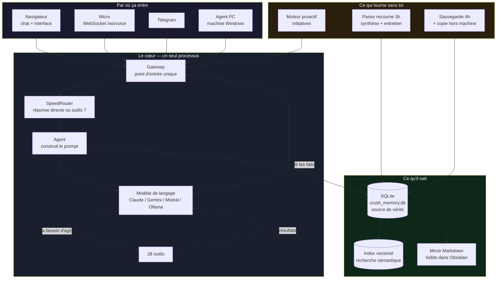

**Le point important** : tout passe par le `Gateway`. Que le message vienne du
navigateur, du micro ou de Telegram, il suit ensuite le même chemin. C'est ce qui
garantit qu'une réponse vocale et une réponse écrite s'appuient sur la même
mémoire et les mêmes outils.

---

## 2. Les quatre couches, et pourquoi elles sont strictes

Le code est découpé en quatre niveaux. Une couche ne peut importer que ce qui est
**en dessous** d'elle, et quatre contrats vérifiés automatiquement l'imposent.

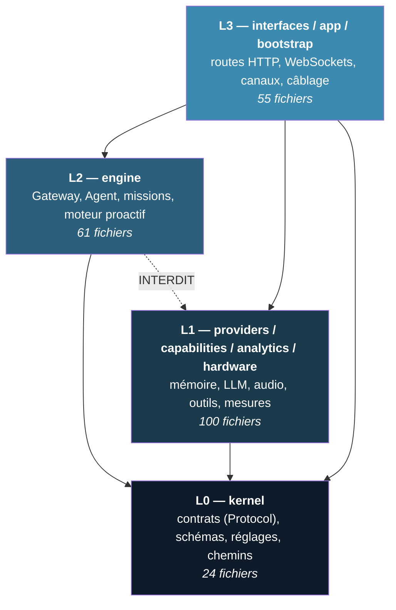

Les quatre règles, telles qu'elles sont écrites dans `pyproject.toml` et
vérifiées à chaque validation :

| Règle | Ce qu'elle interdit |
|---|---|
| **RÈGLE 1** | Le `kernel` ne dépend de rien. C'est le socle. |
| **RÈGLE 2** | `providers`, `capabilities`, `analytics`, `hardware` n'importent **que** `kernel` — jamais l'un l'autre. |
| **RÈGLE 3** | `engine` n'importe **que** `kernel`. Jamais `providers`. |
| **RÈGLE 4** | Aucun module ne passe par l'ancien dossier `config/` à la racine. |

### Pourquoi la RÈGLE 3 est la plus contraignante

Le moteur a besoin de la mémoire, qui vit dans `providers`. Comment fait-il, s'il
ne peut pas l'importer ?

Par un **contrat**. `kernel/contracts.py` déclare la *forme* de ce dont le moteur
a besoin, sans dire qui la remplit :

```python
# kernel/contracts.py — ce que le moteur SAIT
@runtime_checkable
class Transcripteur(Protocol):
    async def transcribe(self, audio: bytes, mime_type: str) -> str: ...
```

Et `bootstrap.py` — la seule couche autorisée à voir les deux — branche
l'implémentation réelle dessus. C'est là que tout le graphe d'objets est
assemblé, une fois, au démarrage.

**Ce que ça achète concrètement** : on peut remplacer le moteur de transcription,
la base de données ou le modèle de langage sans toucher au moteur de décision. Et
quand un contrat change, tous les doubles de test qui ne suivent plus échouent
immédiatement — un vrai cas rencontré : ajouter deux paramètres à l'index
vectoriel a fait échouer un double obsolète dans la seconde.

---

## 3. Le trajet d'un message

Voici ce qui se passe réellement quand tu écris « lance Liberta sur mon PC ».

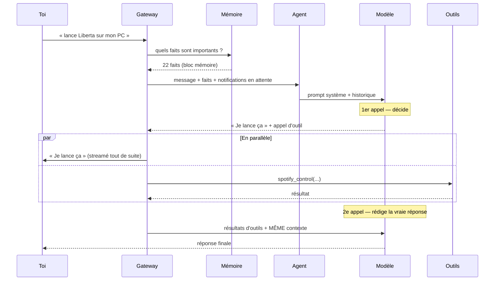

### Les deux appels, et le piège qu'ils cachent

Le premier appel décide et accuse réception. Le second rédige la réponse que tu
lis vraiment.

Un défaut réel a été corrigé ici : le second appel construisait son prompt
**sans arguments**. L'assistant perdait donc les notifications en attente, le
rappel des sessions passées et sa mémoire — précisément dès qu'un outil entrait
en jeu. Le contexte est maintenant retransmis aux deux appels.

**Pourquoi deux appels et pas un seul** : ça permet de te répondre
immédiatement (« Je lance ça ») pendant que l'outil travaille. À l'oral, cette
seconde gagnée change tout.

---

## 4. La mémoire : trois formes, une seule vérité

C'est la partie la plus importante du système, et la plus subtile.

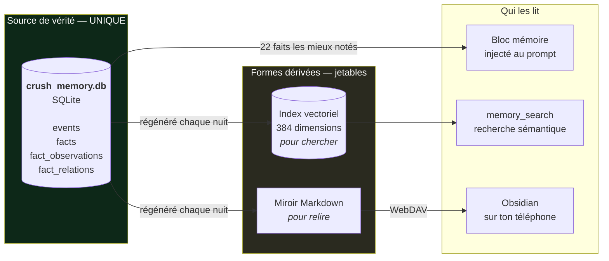

**La règle** : SQLite est la vérité. L'index vectoriel et le miroir Markdown sont
**reconstruits** à partir d'elle, jamais l'inverse. Si l'un des deux est perdu ou
corrompu, on le régénère et rien n'est perdu.

Pourquoi une régénération complète chaque nuit plutôt qu'une mise à jour au fil
de l'eau ? Parce que deux écritures séparées finissent toujours par diverger.
Reconstruire 37 faits prend moins d'une demi-seconde, et le résultat ne dépend
pas de l'historique des pannes.

### Le miroir Markdown est en lecture seule

Il est **unidirectionnel** par choix. Modifier un fichier Markdown ne change pas
la mémoire — ça serait un second chemin d'écriture, donc une source de conflits.

Pour corriger la mémoire depuis ton téléphone, il y a une **boîte de réception** :
un fichier où tu écris ta consigne en langage naturel (« non, je préfère le
thé »), et que la passe nocturne lit et applique.

---

## 5. Comment un fait naît, vit et meurt

Un « fait » est une affirmation atomique : *sujet — prédicat — objet*, avec une
catégorie, une confiance et une date.

```
max  prefers  concision     (preference, confiance 0.75, vu 2 fois)
max  is       cergy         (identity,   confiance 0.55, vu 1 fois)
```

### L'échelle de confiance

Elle n'est pas décorative — elle décide de la manière dont l'assistant parle du
fait :

| Valeur | Signification | Effet |
|---|---|---|
| **0,55** | Inférence faible — déduit de ce que tu as dit | Affiché avec la mention *(déduit)* |
| **0,75** | Énoncé explicite — tu l'as dit | Affirmé normalement |
| **0,90** | Correction humaine — tu as corrigé | Affirmé |
| **0,99** | Plafond après confirmations répétées | Affirmé |

Un défaut mesuré et corrigé ici : le seuil d'affichage était à **0,80**, donc
*au-dessus* de « énoncé explicite ». Résultat : **18 des 22 lignes** du bloc
mémoire portaient une réserve, y compris sur des choses dites explicitement.
L'assistant lisait un mur de doutes, ce qui apprend à tout relativiser. Après
correction : 31 % de réserves au lieu de 81 %, et un bloc 26 % plus court.

### Le cycle de vie

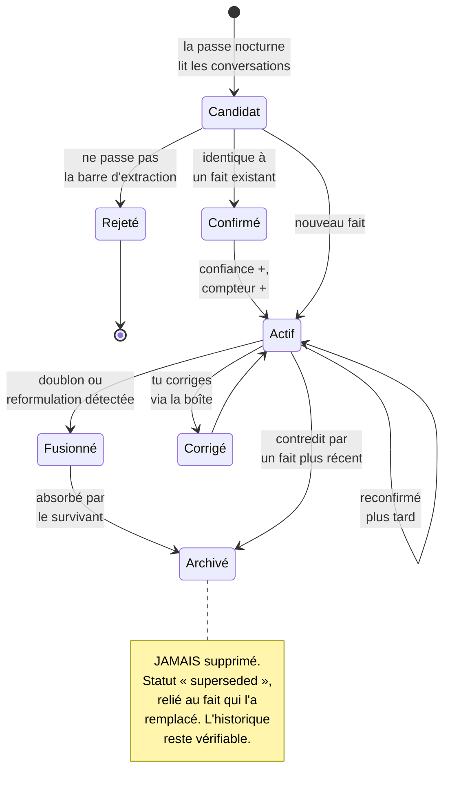

**Rien n'est jamais effacé.** Un fait remplacé passe en `superseded` et reste
relié à son remplaçant. C'est ce qui rend les heuristiques de fusion acceptables :
une erreur de rapprochement est réversible et visible.

### La barre à l'entrée

Cinq refus tirés d'erreurs réellement observées dans la base :

- **Une action demandée n'est pas une préférence.** Demander de jouer un morceau
  est une commande, pas un goût.
- **La cible d'une action n'est pas un outil.** Le morceau joué n'est pas un
  outil — l'outil était Spotify.
- **Un élément de l'interface n'est pas un outil.** Une vue construite pour toi
  n'est pas un logiciel que tu utilises.
- **Ce qui est mentionné n'est pas ce qui est possédé.** Parler d'un Mac ne veut
  pas dire en avoir un.
- **Un objet incompréhensible hors contexte n'est pas un fait.** « decided
  paris » ne dit pas ce qui a été décidé.

### Comment 22 faits sont choisis parmi 37

Le bloc injecté au prompt est plafonné — il est payé à chaque tour de
conversation. La sélection se fait par **tourniquet** :

```
Tour 1 : chaque catégorie prend son meilleur fait
Tour 2 : chaque catégorie prend son deuxième
...      (4 tours)
Puis   : les places restantes vont aux mieux notés
```

Pourquoi pas un simple tri par score ? Parce que la distribution est déséquilibrée
(15 préférences et 13 outils contre 2 faits d'identité et 3 de persona) : une
catégorie nombreuse rafle toutes les places, quelle que soit son utilité.

Un tri par « paliers de catégorie » a été essayé et **simulé sur la vraie base
avant d'être écrit** — il était pire : il faisait entrer quinze goûts musicaux en
évinçant une vraie règle de fonctionnement.

---

## 6. Les outils : 28 capacités

Ce que l'assistant peut réellement *faire*, au-delà de parler.

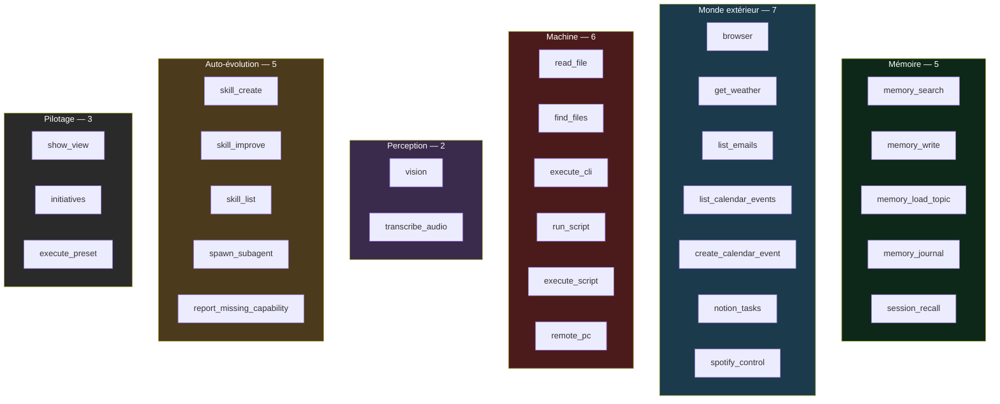

### Un exemple de garde-fou : `transcribe_audio`

Cet outil lit un fichier sur le serveur et l'envoie à une API tierce. C'est
exactement le genre de capacité qui doit refuser avant d'agir :

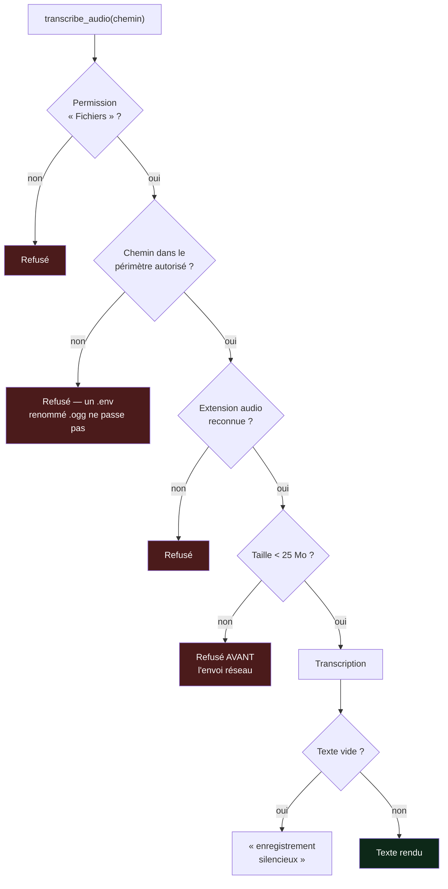

Le périmètre de fichiers est **partagé** avec les outils de lecture, pas
réimplémenté : deux jeux de règles d'accès finissent toujours par diverger, et
c'est là que naissent les trous.

---

## 7. Ce qui tourne la nuit

Sept boucles de fond tournent en permanence. La plus importante est la passe
nocturne de 3h.

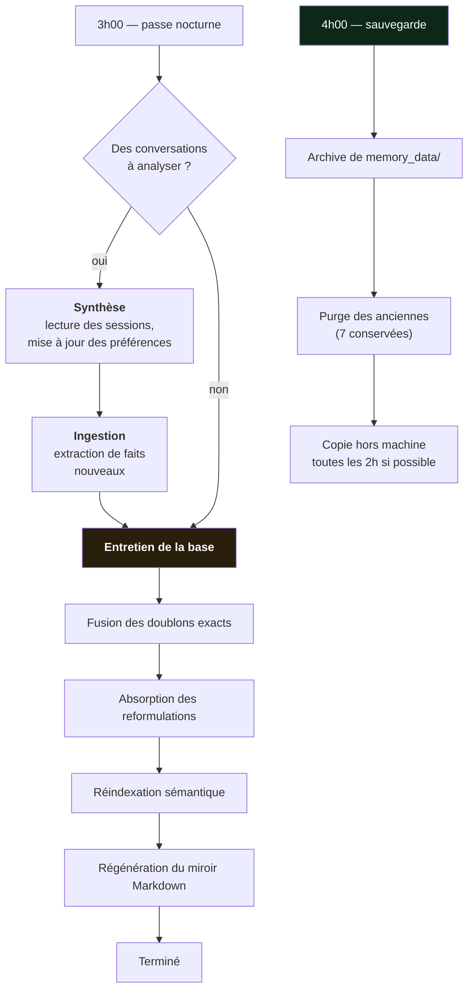

**Un défaut corrigé ici** : la passe sortait tôt quand il n'y avait aucune
conversation à analyser — l'entretien de la base était donc lié à l'activité. La
synthèse et l'entretien sont maintenant indépendants.

L'ordre compte aussi : la réindexation vient **après** les fusions. Sinon un
doublon absorbé pendant la nuit resterait trouvable par la recherche alors qu'il
vient d'être archivé.

### Les autres boucles

| Boucle | Rôle |
|---|---|
| `briefing` | Résumé du matin |
| `calendar` | Rappels avant un événement |
| `autodream` | La passe nocturne décrite ci-dessus |
| `curator` | Entretien des faits, compétences et coûts |
| `skill_lab` | Développement de nouvelles compétences |
| `sauvegarde` | Archivage quotidien |
| `boite` | Lecture de la boîte de réception Obsidian |

---

## 8. Le moteur proactif

Crush peut prendre des initiatives — proposer quelque chose sans qu'on le lui
demande. C'est encadré par un **niveau d'autonomie de 0 à 5**.

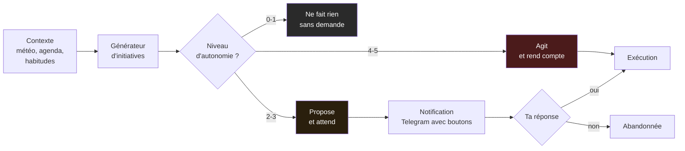

Les initiatives arrivent sur Telegram avec des boutons — tu réponds « oui » d'un
appui, sans ouvrir l'interface. La décision emprunte **un seul chemin
d'exécution** partagé entre Telegram, l'API et le Command Center : le statut est
posé *avant* l'exécution, pour qu'une même initiative ne puisse pas être lancée
deux fois.

Un chiffre mesuré : **64 % des initiatives générées étaient du déchet** avant
correction. La cause n'était pas la génération mais le fait que le générateur ne
voyait pas son propre historique — il reproposait donc indéfiniment ce qui avait
déjà été refusé.

---

## 9. La voix, de bout en bout

Pas de serveur média, pas de service tiers pour le transport : le navigateur
pousse son micro directement sur un WebSocket.

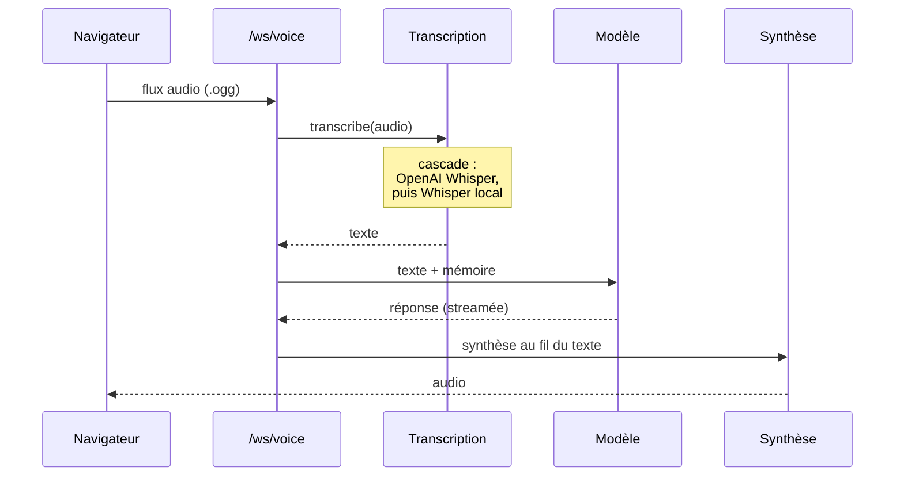

### La cascade de transcription, et sa leçon

Le système essaie l'API OpenAI puis **retombe sur un Whisper local**. Ce repli
existe pour ne pas dépendre du réseau ni d'un quota.

Un défaut réel : le quota OpenAI était épuisé **et** le moteur local n'était pas
installé. La transcription ne fonctionnait donc pas du tout — et comme la voix
partage cette cascade, **l'entrée vocale était hors service**, avec pour seule
trace un avertissement dans le journal. Rien ne le signalait.

Mesures sur un Raspberry Pi 5 :

| Modèle | Vitesse | Exactitude |
|---|---|---|
| `base` | ~2× le temps réel | Se trompe sur les mots porteurs (« audio » → « radio ») |
| `small` | ~6× le temps réel | Correct |

Le repli local reste un filet de sécurité, pas un chemin interactif confortable.

---

## 10. Sécurité : ce qui est fermé, et pourquoi

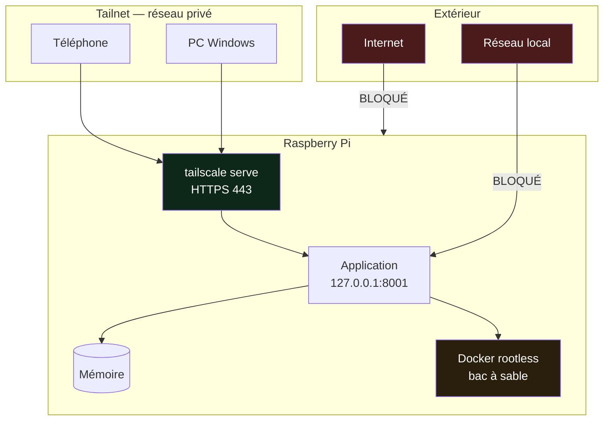

Les choix qui comptent :

- **L'application n'écoute que sur `127.0.0.1`.** Tout l'accès passe par le
  proxy chiffré du réseau privé. Elle écoutait auparavant sur toutes les
  interfaces, donc joignable en HTTP clair depuis le réseau local.
- **Le cookie de session porte `Secure`, `HttpOnly` et `SameSite=strict`.** Le
  drapeau `Secure` dépend du mode de fonctionnement : il n'était pas posé, et le
  cookie pouvait donc voyager en clair.
- **Docker en mode « rootless ».** Le code écrit par le modèle s'exécute dans un
  bac à sable, et le compte qui le lance n'est **pas** dans le groupe `docker` —
  cette appartenance équivaut à un accès root complet à la machine.
- **Les clés d'API ne sont jamais dans une archive.** Le module de sauvegarde
  filtre explicitement `.env`, `*.pem`, `*.key` et les fichiers de jetons, même
  s'ils sont hors du périmètre archivé. « Hors périmètre » est une propriété
  accidentelle, pas une garantie.
- **La clé de sauvegarde ne peut rien exécuter.** Elle est restreinte à
  `internal-sftp` : même volée, elle ne donne aucun accès à un terminal.

---

## 11. Déploiement et surveillance

Le Pi n'est pas un dépôt Git — on y envoie une archive par SSH.

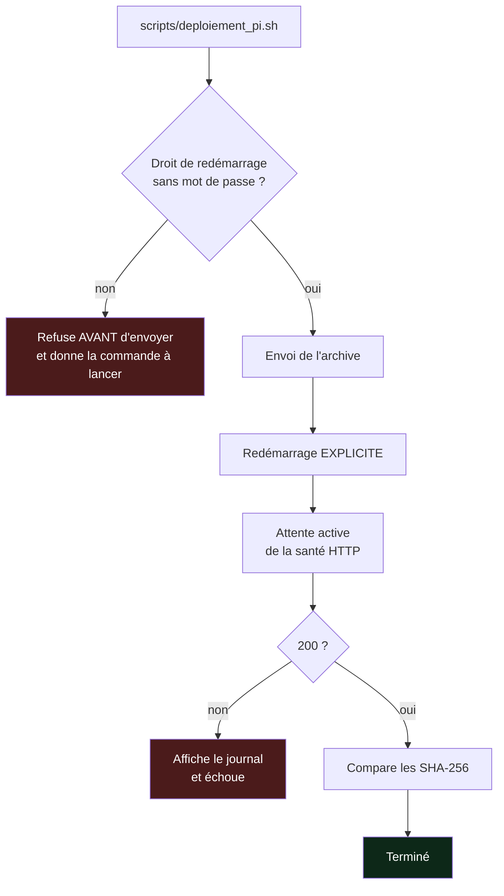

**Pourquoi vérifier le droit de redémarrage avant d'envoyer** : sinon on écrase
les fichiers puis on découvre qu'on ne peut pas les activer. Le service tourne
alors sur l'ancien code avec le nouveau sur le disque, et rien ne le dit.

Deux contrôles qui *semblent* valider ce droit et ne valident rien — tous deux
constatés sur la machine réelle :

- `systemctl restart --dry-run` réussit **sans privilège**.
- `sudo -l <commande>` répond « autorisé » à cause d'une règle générale qui exige
  justement un mot de passe.

### La surveillance

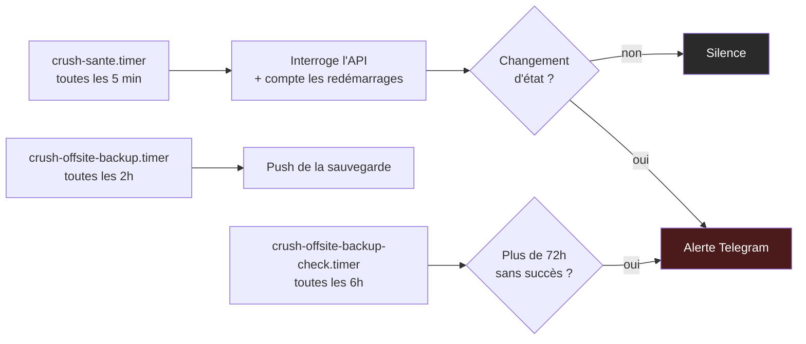

**Le principe des alertes : on signale les transitions, jamais les états.** Un
contrôle toutes les 5 minutes sur un service en panne enverrait douze messages
par heure — et la première chose qu'on fait alors est de couper les
notifications, donc de perdre l'alerte utile. Un message quand ça tombe, un
message quand ça revient.

Même logique pour la sauvegarde hors machine : le PC est éteint la plupart du
temps, donc l'échec est l'état normal. L'alerte porte sur l'**ancienneté** du
dernier succès, pas sur le résultat de la dernière tentative.

Les scripts de surveillance sont en **bash**, pas en Python. Ils sont appelés
précisément quand l'application est en panne : s'appuyer sur son environnement
virtuel, c'est risquer que le messager tombe pour la même raison que le message.

---

## 12. Les cinq portes qualité

Rien n'est déployé sans que les cinq passent.

| # | Porte | Ce qu'elle vérifie |
|---|---|---|
| 1 | `ruff check` | Style, erreurs, lignes ≤ 100 caractères, annotations exigées |
| 2 | `import-linter` | Les quatre contrats de couches |
| 3 | `mypy` | Conformité des contrats au démarrage |
| 4 | `pytest` | **1650 tests** (hors intégration) |
| 5 | `snapshot_routes` | Les **208 routes HTTP** identiques à la référence |

Plus un test de démarrage réel (`smoke_runtime.py --fake-llm`) qui construit le
graphe d'objets complet et affiche `BOOT OK`.

### Pourquoi la cinquième porte existe

Une refonte d'architecture peut casser une route HTTP sans qu'aucun test ne le
voie. La liste des 208 routes est figée dans un fichier de référence, et toute
différence doit être justifiée. C'est une preuve mécanique que l'interface
publique n'a pas bougé.

---

## Pour aller plus loin

| Fichier | Contenu |
|---|---|
| `README.md` | Installation et démarrage |
| `.specify/memory/constitution.md` | Les principes non négociables du projet |
| `docs/architecture/CDC_refonte_architecture.md` | Le cahier des charges de l'architecture |
| `.env.example` | Tous les réglages, documentés |
